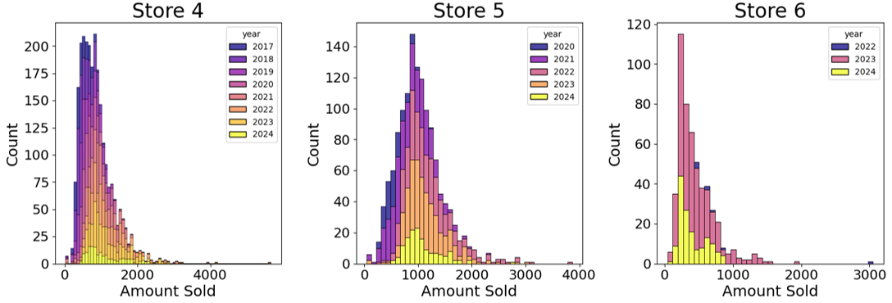
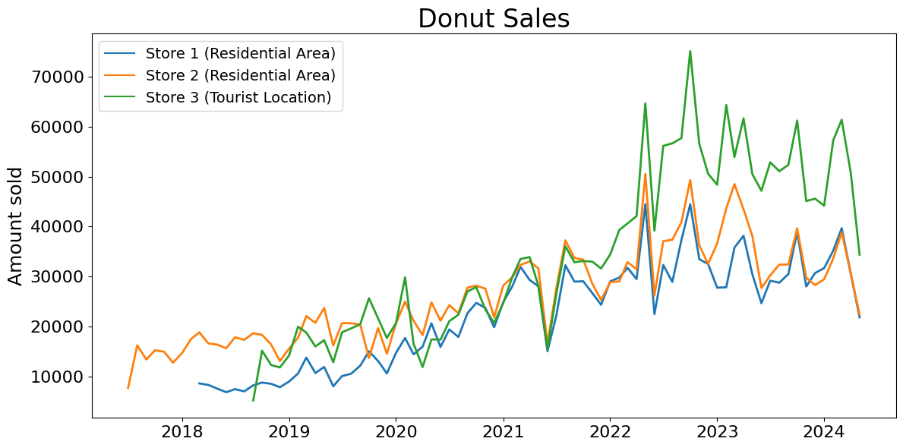
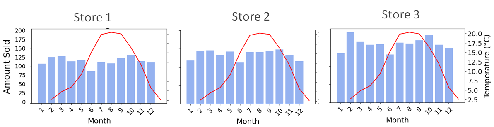
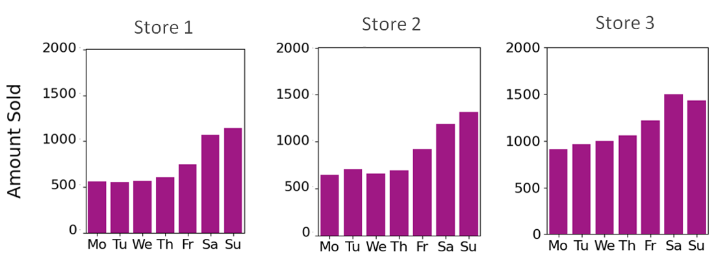
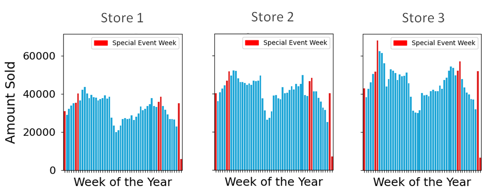
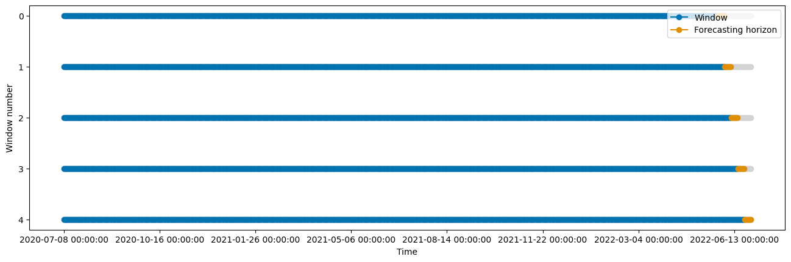
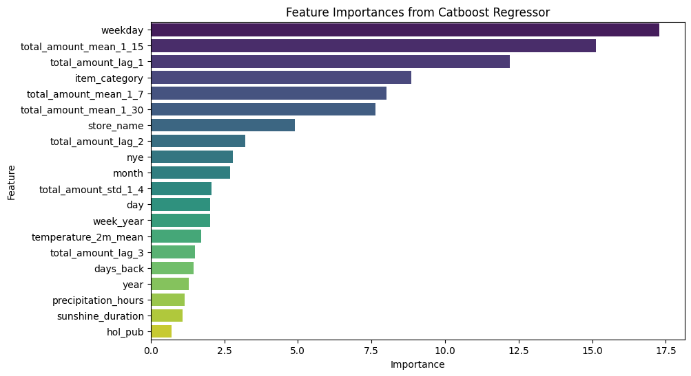
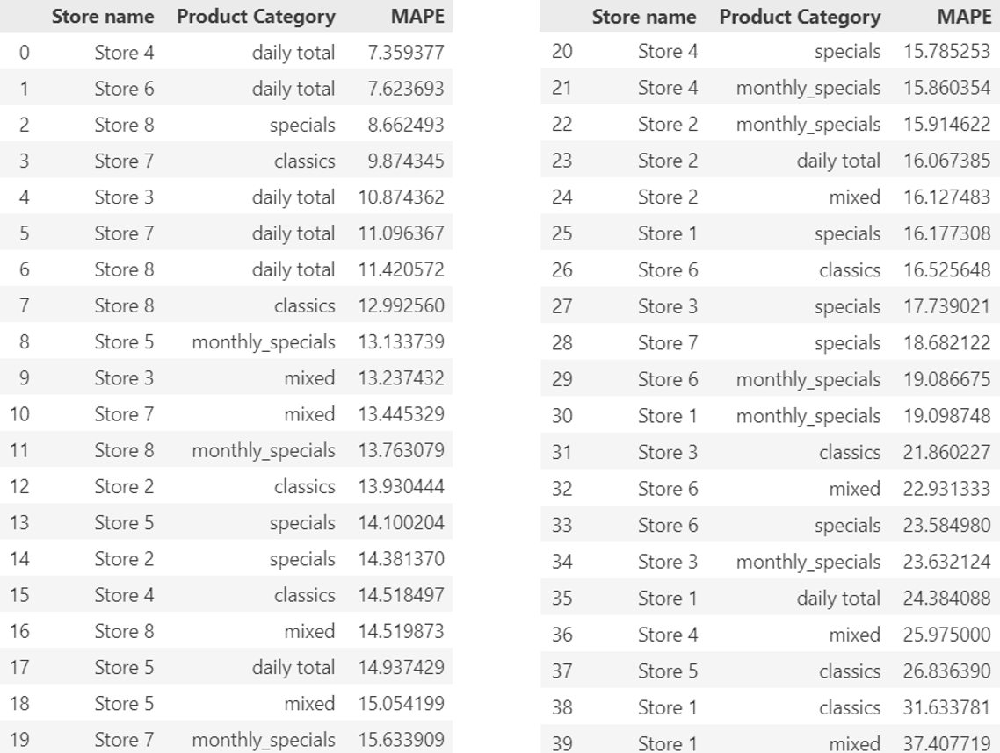
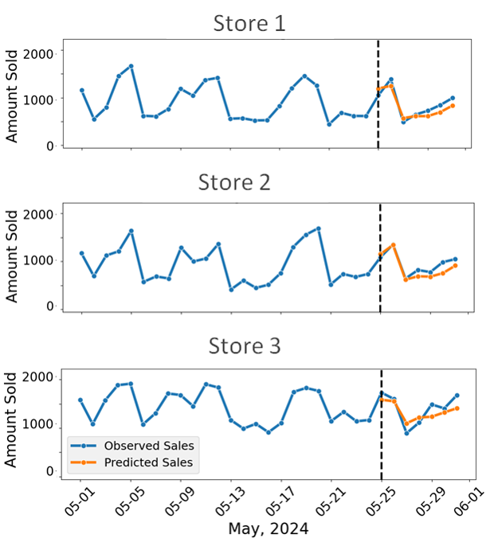

# sweetspot - A Time-Series Forecasting Model for Reducing Food Waste

 

Operating a food business comes with a unique set of challenges. Apart from health and safety standards or supply chain disruptions, the Food & Beverage (F&B) sector is struggling with perishability and waste, with roughly one-third of food being discarded every year. 

In light of this challenge, this project aims to ameliorate the issue of food waste by developing a planning tool - called sweetspot - for more precise sales forecasting of a German donut manufacturer. By applying machine learning, this project can support accurate sales planning and better inventory management through the use of a wide variety of input information. 

In the EU alone, food waste accounts for ~16% of the F&B sector's CO2 emissions. To address this, the [EU Commission](https://food.ec.europa.eu/safety/food-waste/eu-actions-against-food-waste/food-waste-measurement_en) has proposed the reduction of food waste by 10% by 2030. The main priority is **avoiding surplus food generation.** In this context, digital technologies, such as the sweetspot planning tool, can greatly help manufacturers achieve regulatory compliance. 

---

This Capstone project was completed as part of the [Spiced Academy Data Science Bootcamp](https://www.spiced-academy.com/en/program/data-science).

The project was done in collaboration with:

* [Rachel Brochado](https://github.com/mrachelb)
* [Alex Cabral](https://github.com/AlleeCabral)
* [Malte Oehlmann](https://github.com/malte-oehlmann)

 

## Project overview

* Understanding the dataset through Exploratory Data Analysis - Examining histograms, scatterplots and boxplots 
* Examining relationshships between features (correlations, Anova) and selecting relevant variables
* Feature Engineering - Transforming variables for time-series forecasting
* Model Building - Linear regression (baseline), Random Forests and CatBoost
* Evaluating training, validation and test metrics - R2, Root mean squared error, Mean Absolute Percentage Error

## Repository content
* **Visuals:** Contains graphs, visualisations and evaluation results
* Visualisation_EDA (python notebook): Data exploration and visualisations
* Feature Engineerng (python notebook): Transformation of features and constructing new variables
* Baseline LM (python notebook): Linear Regression baseline model
* Forests (python notebook): Random Forests model
* Catboost (python notebook): CatBoost model
* **Function Scripts:** Python scripts with functions
* **Quarto files:** Quarto files of all notebooks

 

## Resources used
* **Python version:** pyenv with python 3.11.3
* **Cloud System**: Google Colab
* **EDA Packages**: pandas, numpy, matplotlib, seaborn
* **Machine Learning Packages**: Scikit-Learn, CatBoost, Optuna Hyperparameter Tuner
* **Time-Series Packages**: sktime

 

---

## Dataset

The dataset contains over 160,000 recorded transactions of donut sales. It is a hierarchical time-series dataset where each row represents the amount of donuts sold per store, product type and per day. The dataset contains records from 13 stores and for over 300 product types between July 2017 and May 2024. There are no missing values in the dataset.

### Data cleaning and feature engineering

The dataset was augmented by transforming and adding new variables (covariates) that should be good predictors of donut sales.

* Converted the "date" variable to a datetime type
* Clustered product items into 8 separate categories
* Calculated total amount of sold donuts (i.e. boxes containing multiple donuts were recorded as a selling only 1 donut)
* Removed stores which had insufficient or incoherent data
* Calculated the total number of sold donuts per day for each store
* Included temperature (°C), precipitation (hours), sunshine duration (hours) as new features
* Reclassified donuts from the "other" category as a donut type (some donuts were categorized wrongly initially)
* Included public and school holidays as a new feature
* Added time information: 
    * Weekday (Monday to Sunday)
    * Day of the year (1 - 365)
    * Month (1 - 12)
    * Year
    * Week of the year (1 - 52)
* Timestep (days since the first recorded transaction to account for the overall sales trend)
* Created Window Variables:
    * Lagged variables 
    * Moving average
    * Moving standard deviation
* Added dummy variables for special events
    * New Year's Eve
    * Halloween
    * Valentine's Day
* Added Street Market dummy variable (some stores are located next to weekly street markets)
* Added Public Space dummy variable 
* Added Box Deal dummy variable
* Binned weather variables into five categories for easier EDA

 

### Variables in the dataset

After the data cleaning and feature transformation steps, the dataset contained the following 25 variables:

* Date	
* Store name
* Item category
* Total amount (donuts sold)
* Temperature 
* Precipitation
* Sunshine duration
* Public holidays
* School holidays
* Weekday
* Day of the year
* Month
* Year
* Week of the year
* Weekend dummy
* Timestep
* Lag (last 1, 2 and 3 days)
* Moving average (last 7, 15 and 30 days)
* Moving standard deviation (last 4 days)
* New Year's Eve dummy
* Valentine's Day dummy
* Halloween dummy
* Street market dummy
* Public space dummy
* Box Deal dummy
* Binned Temperature
* Binned Precipitation
* Binned Sunshine duration

 

## Exploratory Data Analysis (EDA)

EDA was performed by way of analyzing histograms, boxplots and scatterplots in order to establish relationships between the target variable (sales) and the remaining explanatory (independent) variables. Associations between explanatory variables were also examined in order to detect potential multicollinarities. 

Here are the highlights of the EDA:

**1. Histogram**

The histograms show that *daily sales* are not normally distributed. While not problematic for predictions based on tree-based algorithms, the target variable needed to be log-transformed for the linear regression model. Moreover, with each passing year, the number of daily sales has, on average, increased.

 

**2. Time-series line chart**

Donut sales follow a clear upwards trend, both in residential and more touristic locations. The Covid pandemic has halted this development for a while. There was a big increase in sales when lockdowns ended in early 2022. Since then, sales have stabilized and even decreased after the hype toned down. 

Seasonal patterns can also be observed. During summer, donut sales tend to dip, presumably because of other competing products available during that time.

 

**3. Temperature and sales**

Sales tend to decrease when temperatures are high (*red line*), especially during the month of June. They peak between 10-15°C and taper off when it gets too hot. 

 

**4. Weekday**

There is a clear difference between sales happening on the weekend, including Friday, and the rest of the week. 

 

**5. Special events**

Sales peak during certain weeks with special events. Most notably during the last week of the year and New Year's Eve.

 

## Model Building

Three models were built in total.

1. Linear Regression model, which served as a baseline model

2. Random Forests (RF) model

3. CatBoost model

#### Cross-validation and hyperparameter tuning

The RF and Catboost models were trained using time-series cross-validation, akin to the split depicted in the graph below. The model was cross-validated on a dataset consisting of 7 days. The process also involved tuning different sets of hyperparameters to find the combination that resulted in the smallest RMSE.

 

The model was ultimately tested on the test dataset consisting of the final 7 days in May 2024 (May 25 - May 31).

 

#### Evaluation metrics

The model was evaluated based on **R-square** and **MAPE** scores.

*R2* represents the proportion of the variance in the dependent variable that is predictable from the independent (explanatory) variables. For example, an R-squared of 0.8 means that 80% of the variance in the target variable is explained by the model. It is a measure of the model's general goodness of fit and is useful when comparing different model performances.

*MAPE*, on the other hand, is an error metric. A MAPE of 5% means that, on average, the forecast is off by 5% from the actual value. MAPE penalizes both overestimations (i.e. overproduction leading to food waste) and underestimations (i.e. unfulfilled customer demand) equally. 

 

### Feature importances

The most important features that explain sales are mainly related to temporal variables. Most notably, the model confirms the original assumption different weekdays - especially weekend days - are good predictors of sales. Window variables, especially moving averages and lag features, also explain sales trends well.

Important exogenous features are, expectedly, the item categories and individual stores. Other exogenous variables, such as New Year's Eve and weather features, also play a noticable role in forecasting sales well. 

 

## Model performance

The three models were evaluated on the overall R2 and MAPE. These are the results.

| Model | R2 | MAPE | 
|-----------|------------------------|----------|
Linear regression (Baseline)    | 0.90        | 26% |
Random Forests    | 0.94         | 22% |
Catboost    | 0.96         | 17% |

 

**The Catboost model did the best job at forecasting donut sales.**

 

The models' MAPE was further calculated at the store and product level, including total daily sales. Results are shown for the best performing model (Catboost).

 

With a **MAPE of ~15%**, the **sweetspot model is able to forecast donut sales of more than a half store-product combinations quite well**. These include products such as classic donuts, mixed boxes and monthly specials as well as total daily sales.

Finally, the time-series line charts below visually depict the Catboost model's predictions for total daily sales.

  

For a more comprehensive overview of the analysis, please refer to the following notebooks 

* *Feature_engineering.ipynb*
* *Visualization_EDA.ipynb*
* *baseline_lm.ipynb*
* *forests.ipynb*
* *catboost.ipynb*

 

## Productionization

The Catboost-based sweetspot model has shown great potential to accurately forcast sales of a German donut manufacturer.

However, in order to make this a viable product, the sweetspot model will have to make forecasts on a continuous stream of data for more than just a week.